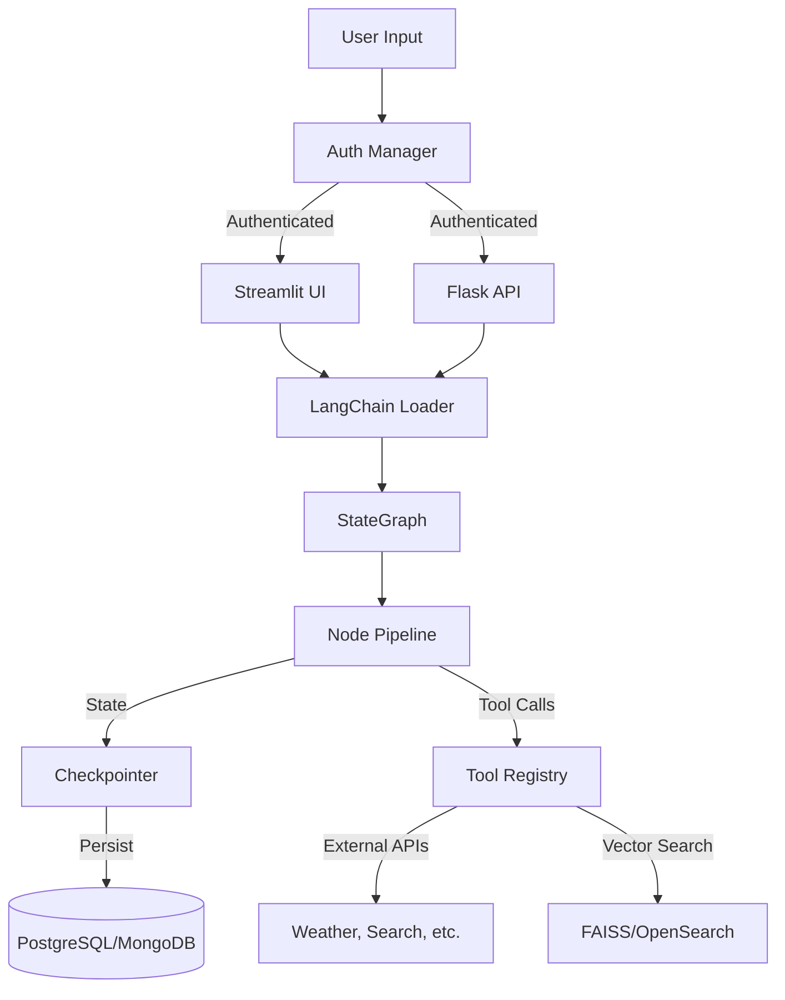

# BiliCore Architecture

This document describes the architecture and organization of the BiliCore framework.

## Overview

BiliCore is an open-source framework for benchmarking and building dynamic RAG (Retrieval-Augmented Generation) implementations. It enables rapid testing of LLMs across different cloud providers (AWS Bedrock, Google Vertex AI, Azure OpenAI, OpenAI) and local environments.

## Directory Structure

```
bili-core/
├── bili/                      # Main Python package
│   ├── auth/                  # Authentication system
│   │   └── providers/         # Auth provider implementations
│   │       ├── auth/          # Authentication providers (Firebase, SQLite, In-memory)
│   │       ├── role/          # Role/permission providers
│   │       └── profile/       # User profile providers
│   ├── checkpointers/         # State persistence layer
│   │   ├── migrations/        # Schema migrations (Mongo, PostgreSQL)
│   │   ├── base_checkpointer.py
│   │   ├── mongo_checkpointer.py
│   │   ├── pg_checkpointer.py
│   │   └── memory_checkpointer.py
│   ├── config/                # Configuration management
│   │   ├── llm_config.py      # LLM model configurations
│   │   ├── tool_config.py     # Tool configurations
│   │   └── middleware_config.py
│   ├── flask_api/             # Flask REST API
│   ├── graph_builder/         # LangGraph construction utilities
│   │   └── classes/           # Node, ConditionalEdge classes
│   ├── loaders/               # Component initialization
│   │   ├── langchain_loader.py  # Graph builder
│   │   ├── tools_loader.py    # Tool initialization
│   │   ├── llm_loader.py      # LLM initialization
│   │   ├── embeddings_loader.py
│   │   └── middleware_loader.py
│   ├── nodes/                 # LangGraph node implementations
│   │   ├── add_persona_and_summary.py
│   │   ├── inject_current_datetime.py
│   │   ├── per_user_state.py
│   │   ├── react_agent_node.py
│   │   ├── update_timestamp.py
│   │   ├── trim_and_summarize.py
│   │   └── normalize_state.py
│   ├── tools/                 # Tool implementations
│   │   ├── faiss_memory_indexing.py
│   │   ├── amazon_opensearch.py
│   │   ├── api_serp.py
│   │   ├── api_weather_gov.py
│   │   ├── api_open_weather.py
│   │   └── mock_tool.py
│   ├── streamlit_ui/          # Streamlit components
│   │   └── ui/                # UI modules
│   ├── utils/                 # Utility functions
│   ├── streamlit_app.py       # Streamlit entry point
│   └── flask_app.py           # Flask entry point
├── scripts/                   # Build and development scripts
│   ├── development/           # Container scripts
│   └── build/                 # Build scripts
├── env/                       # Environment configurations
├── data/                      # Data files (FAISS indexes, etc.)
├── models/                    # Local model files (symlink)
├── CLAUDE.md                  # AI assistant guidelines
├── requirements.txt           # Python dependencies
├── setup.py                   # Package installation
└── docker-compose.yml         # Container orchestration
```

## Core Components

### 1. Authentication System (`bili/auth/`)

Modular authentication with pluggable providers implementing a common interface:

```
AuthManager
├── AuthProvider (Firebase, SQLite, In-memory)
├── ProfileProvider (user profile data)
└── RoleProvider (permissions/roles)
```

Each provider type has multiple implementations:
- **Firebase**: Production auth via Firebase Admin SDK
- **SQLite**: Local development with persistent storage
- **In-memory**: Testing/ephemeral sessions

### 2. Checkpointers (`bili/checkpointers/`)

State persistence layer supporting multiple backends. All checkpointers implement the `QueryableCheckpointerMixin` interface:

```python
class QueryableCheckpointerMixin(ABC):
    def get_user_threads(user_identifier, limit, offset) -> List[Dict]
    def get_thread_messages(thread_id, limit, offset, message_types) -> List[Dict]
    def delete_thread(thread_id) -> bool
    def get_user_stats(user_identifier) -> Dict
    def thread_exists(thread_id) -> bool
    def verify_thread_ownership(thread_id, user_identifier) -> bool
```

Available implementations:
- **PostgresSaver**: Production with PostGIS support
- **MongoDBSaver**: Document-based storage
- **MemorySaver**: In-memory for testing

### 3. LLM Configuration (`bili/config/`)

Configurations for 60+ LLMs across providers:

| Provider | Examples |
|----------|----------|
| AWS Bedrock | Claude 3/3.5, Llama, Mistral |
| Google Vertex AI | Gemini Pro/Flash |
| Azure OpenAI | GPT-4, GPT-4o |
| OpenAI | GPT-4, GPT-4o, o1 |
| Local | Ollama models |

Factory pattern initialization via `llm_loader.py`.

### 4. LangGraph Workflow (`bili/loaders/`, `bili/nodes/`)

Node-based workflow system with registry pattern. See [LANGGRAPH.md](./LANGGRAPH.md) for details.

**Default Pipeline:**
```
START → persona_summary → datetime → react_agent → timestamp → trim_summarize → normalize → END
```

### 5. Tools Framework (`bili/tools/`)

Extensible tool system with registry-based loading. See [TOOLS.md](./TOOLS.md) for details.

**Available Tools:**
- FAISS vector search
- Amazon OpenSearch
- Weather APIs (OpenWeather, Weather.gov, Free Weather)
- SERP API (web search)
- Mock tool (testing)

### 6. Middleware System

Intercepts and modifies agent execution at two levels:
- **Agent-level**: Applied to entire conversation flow
- **Tool-level**: Applied to specific tool executions

Built-in middleware:
- `summarization`: Auto-summarize long conversations
- `model_call_limit`: Limit LLM invocations per turn

## Application Entry Points

### Streamlit Application (`streamlit_app.py`)

Interactive web UI for testing and configuration:

```python
def main():
    configure_streamlit()  # Page setup
    st.session_state.auth_manager = initialize_auth_manager(...)
    check_auth()  # Authentication
    checkpointer = get_checkpointer()
    run_app_page(checkpointer)  # Main UI
```

### Flask API (`flask_app.py`)

REST API for programmatic access and integration with other services.

## Design Patterns

### Provider Pattern
Consistent interfaces across auth, LLM, checkpointer, and tool providers enable swapping implementations without changing consuming code.

### Registry Pattern
Dynamic registration for nodes and tools:
```python
GRAPH_NODE_REGISTRY = {
    "add_persona_and_summary": persona_and_summary_node,
    "react_agent": react_agent_node,
    # ... extensible via custom_node_registry
}

TOOL_REGISTRY = {
    "faiss_retriever": lambda name, prompt, params: ...,
    "weather_api_tool": lambda name, prompt, params: ...,
    # ... extensible
}
```

### Factory Pattern
Model and checkpointer initialization based on configuration:
```python
llm = load_llm(provider="aws_bedrock", model_name="claude-3-5-sonnet")
checkpointer = get_checkpointer()  # Auto-selects based on environment
```

### Async/Sync Dual APIs
Both synchronous and asynchronous interfaces throughout for flexibility.

## Data Flow



## Configuration

### Environment Variables
Key configuration via environment:
- `BILI_ENV`: Environment (local, development, production)
- `CHECKPOINTER_TYPE`: postgres, mongo, memory
- LLM provider credentials (AWS, Google, Azure, OpenAI)

### Configuration Files
- `scripts/development/secrets.template`: Template for secrets
- `env/bili_root/.aws/`: AWS credentials
- `env/bili_root/.google/`: Google Cloud credentials

## Development Workflow

1. **Container Development** (recommended):
   ```bash
   cd scripts/development
   ./start-container.sh
   ./attach-container.sh
   streamlit  # Start Streamlit
   ```

2. **Code Quality**:
   ```bash
   ./run_python_formatters.sh  # Must pass before commit
   ```

3. **Testing**:
   ```bash
   pytest tests/
   ```

## Key Dependencies

| Package | Purpose |
|---------|---------|
| langchain | LLM orchestration |
| langgraph | Workflow graphs |
| streamlit | Web UI |
| flask | REST API |
| psycopg | PostgreSQL |
| pymongo | MongoDB |
| faiss-cpu | Vector similarity |
| boto3 | AWS services |

## See Also

- [LANGGRAPH.md](./LANGGRAPH.md) - LangGraph workflow documentation
- [TOOLS.md](./TOOLS.md) - Tools framework documentation
- [STREAMLIT.md](./STREAMLIT.md) - Streamlit UI documentation
- [../CLAUDE.md](../CLAUDE.md) - Development commands and patterns
