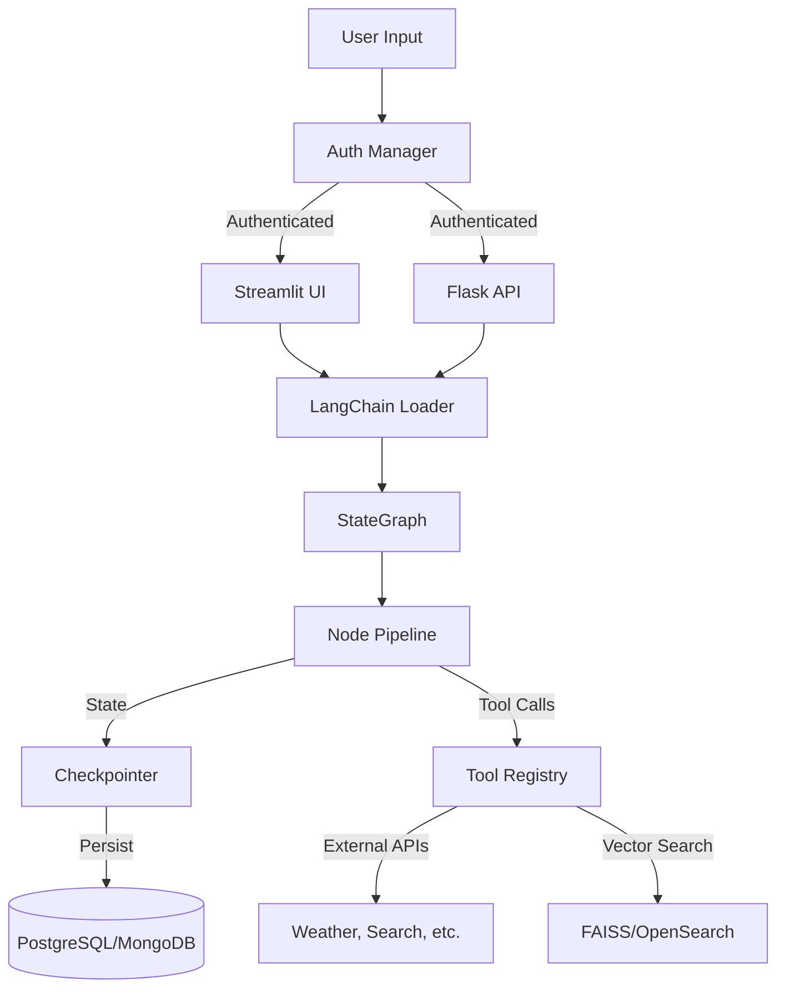

# BiliCore Architecture

This document describes the architecture and organization of the BiliCore framework. It is written for new developers joining the project; if you are already familiar with the codebase, the [Table of Contents](#core-components) can help you jump to the section you need.

## Overview

BiliCore is an open-source framework for benchmarking and building dynamic RAG (Retrieval-Augmented Generation) implementations. It enables rapid testing of LLMs across 18 provider types — 11 remote API providers (AWS Bedrock, Google Vertex AI, Azure OpenAI, OpenAI, Anthropic, Mistral AI, Cohere, Google Generative AI, DeepSeek, xAI, Groq), 3 CLI presets (Claude Code, Codex, Gemini CLI), a generic CLI subprocess provider, and 3 local providers (llama.cpp, HuggingFace, Ollama).

The codebase is split into **three major subsystems** plus a set of shared modules:

| Subsystem | Package | Responsibility |
|-----------|---------|----------------|
| **IRIS** | `bili/iris/` | Single-agent RAG orchestration -- LLM configs, LangGraph workflows, tools, checkpointers, and loaders |
| **AETHER** | `bili/aether/` | Multi-agent system (MAS) framework -- declarative YAML workflows, communication protocols, streaming execution |
| **AEGIS** | `bili/aegis/` | Security testing and evaluation -- adversarial attack runners, LLM evaluators, security scanners |

Shared modules (`bili/auth/`, `bili/utils/`, `bili/flask_api/`, `bili/streamlit_ui/`, `bili/prompts/`) are consumed by all three subsystems.

## Directory Structure

```
bili-core/
├── bili/                          # Main Python package
│   ├── iris/                      # IRIS: Single-agent RAG orchestration
│   │   ├── checkpointers/         #   State persistence layer
│   │   │   ├── migrations/        #     Schema migrations (Mongo, PostgreSQL)
│   │   │   ├── base_checkpointer.py
│   │   │   ├── mongo_checkpointer.py
│   │   │   ├── pg_checkpointer.py
│   │   │   └── memory_checkpointer.py
│   │   ├── config/                #   Configuration management
│   │   │   ├── llm_config.py      #     LLM model configurations (107 models, 18 provider types)
│   │   │   ├── tool_config.py     #     Tool configurations
│   │   │   └── middleware_config.py
│   │   ├── graph_builder/         #   LangGraph construction utilities
│   │   │   └── classes/           #     Node, ConditionalEdge classes
│   │   ├── loaders/               #   Component initialization
│   │   │   ├── langchain_loader.py  #   Graph builder & node registry
│   │   │   ├── tools_loader.py    #     Tool initialization & registry
│   │   │   ├── llm_loader.py      #     LLM initialization (factory pattern)
│   │   │   ├── embeddings_loader.py
│   │   │   └── middleware_loader.py
│   │   ├── nodes/                 #   LangGraph node implementations
│   │   │   ├── add_persona_and_summary.py
│   │   │   ├── inject_current_datetime.py
│   │   │   ├── per_user_state.py
│   │   │   ├── react_agent_node.py
│   │   │   ├── update_timestamp.py
│   │   │   ├── trim_and_summarize.py
│   │   │   └── normalize_state.py
│   │   └── tools/                 #   Tool implementations
│   │       ├── faiss_memory_indexing.py
│   │       ├── amazon_opensearch.py
│   │       ├── api_serp.py
│   │       ├── api_weather_gov.py
│   │       ├── api_open_weather.py
│   │       └── mock_tool.py
│   ├── aether/                    # AETHER: Multi-agent system framework
│   │   ├── runtime/               #   MASExecutor, streaming, events
│   │   ├── docs/                  #   Detailed AETHER documentation
│   │   └── ...                    #   Workflows, channels, agents, configs
│   ├── aegis/                     # AEGIS: Security testing & evaluation
│   │   ├── attacks/               #   Adversarial attack runners
│   │   ├── evaluator/             #   LLM output evaluators
│   │   ├── security/              #   Security scanning utilities
│   │   └── tests/                 #   AEGIS-specific tests
│   ├── auth/                      # Shared: Authentication system
│   │   └── providers/             #   Auth provider implementations
│   │       ├── auth/              #     Firebase, SQLite, In-memory
│   │       ├── role/              #     Role/permission providers
│   │       └── profile/           #     User profile providers
│   ├── flask_api/                 # Shared: Flask REST API
│   ├── streamlit_ui/              # Shared: Streamlit components
│   │   └── ui/                    #   UI modules
│   ├── prompts/                   # Shared: System prompts and templates
│   ├── utils/                     # Shared: Utility functions
│   ├── streamlit_app.py           # Streamlit entry point
│   └── flask_app.py               # Flask entry point
├── scripts/                       # Build and development scripts
│   ├── development/               #   Container scripts
│   └── build/                     #   Build scripts
├── env/                           # Environment configurations
├── data/                          # Data files (FAISS indexes, etc.)
├── models/                        # Local model files (symlink)
├── CLAUDE.md                      # AI assistant guidelines
├── requirements.txt               # Python dependencies
├── setup.py                       # Package installation
└── docker-compose.yml             # Container orchestration
```

## Core Components

### 1. Authentication System (`bili/auth/`) -- Shared

The authentication system lives outside the three subsystems because it is shared by IRIS, AETHER, and AEGIS. It uses a provider-based architecture with pluggable implementations behind a common interface:

```
AuthManager
├── AuthProvider (Firebase, SQLite, In-memory)
├── ProfileProvider (user profile data)
└── RoleProvider (permissions/roles)
```

Each provider type has multiple implementations:
- **Firebase**: Production auth via Firebase Admin SDK (used in AWS deployments)
- **SQLite**: Local development with persistent storage (auto-grants `researcher` role)
- **In-memory**: Testing/ephemeral sessions (no persistence across restarts)

### 2. Checkpointers (`bili/iris/checkpointers/`) -- IRIS

Checkpointers are the state persistence layer for LangGraph agents. Every time a node in the graph executes, the current state (messages, summaries, metadata) is saved to a checkpoint so it can be resumed later. All checkpointers implement the `QueryableCheckpointerMixin` interface, which adds conversation-management queries on top of LangGraph's base checkpointer:

```python
class QueryableCheckpointerMixin(ABC):
    def get_user_threads(user_identifier, limit, offset) -> List[Dict]
    def get_thread_messages(thread_id, limit, offset, message_types) -> List[Dict]
    def delete_thread(thread_id) -> bool
    def get_user_stats(user_identifier) -> Dict
    def thread_exists(thread_id) -> bool
    def verify_thread_ownership(thread_id, user_identifier) -> bool
```

Available implementations:
- **PostgresSaver**: Production with PostGIS support
- **MongoDBSaver**: Document-based storage
- **MemorySaver**: In-memory for testing

#### Multi-Tenant Security

All checkpointers support multi-tenant isolation via the `user_id` parameter:

```python
from bili.iris.checkpointers.pg_checkpointer import AsyncPostgresSaver

# Initialize checkpointer with user_id for multi-tenant isolation
checkpointer = AsyncPostgresSaver.from_conn_string(
    conn_string="postgresql://...",
    user_id="user@example.com"  # Enforces thread ownership validation
)
```

**Thread Ownership Validation:**
- Thread IDs must follow pattern: `{user_id}` or `{user_id}_{conversation_id}`
- Checkpointer validates ownership on all operations (get, put, delete)
- Raises `PermissionError` if thread doesn't belong to authenticated user
- Validation disabled when `user_id=None` (backward compatible)

**On-Demand Schema Migration:**
- Database schema changes occur only when `user_id` first provided
- PostgreSQL: Adds `user_id` column with index on first use
- MongoDB: Adds `user_id` field to documents on first use
- Zero downtime - migrations run automatically during checkpointer initialization

#### Multi-Conversation Support

Users can maintain multiple isolated conversation threads via `conversation_id`:

```python
# Default conversation (backward compatible)
config = {"configurable": {"thread_id": "user@example.com"}}

# Named conversations
config_work = {"configurable": {"thread_id": "user@example.com_work"}}
config_personal = {"configurable": {"thread_id": "user@example.com_personal"}}
```

**Thread ID Pattern:**
- Single conversation: `{user_id}` (e.g., `user@example.com`)
- Multi-conversation: `{user_id}_{conversation_id}` (e.g., `user@example.com_work`)
- Conversations are isolated - separate state, messages, and checkpoints

**Flask API Integration:**
```python
# Flask route with multi-conversation support
@app.route("/chat", methods=["POST"])
def chat():
    data = request.get_json()
    conversation_id = data.get("conversation_id")  # Optional
    return handle_agent_prompt(g.user, agent, data["prompt"], conversation_id)
```

#### Cloud-Ready State Management

Checkpointers provide cloud-native state persistence replacing file-based storage:

**Before (File-Based):**
- State stored in JSONL files on disk
- Lost when Kubernetes pods restart
- Not suitable for multi-instance deployments

**After (State-Based):**
- State persisted in PostgreSQL/MongoDB
- Survives pod restarts and scaling events
- Multi-instance safe with shared database backend
- Automatic state recovery on agent initialization

**Defense-in-Depth Security:**
- **Layer 1**: MASExecutor validates `user_id` and `conversation_id`
- **Layer 2**: Checkpointer validates thread ownership on every operation
- **Layer 3**: Database-level user isolation via indexed `user_id` column

**Backward Compatibility:**
- All security features are opt-in via `user_id` parameter
- Existing code without `user_id` continues to work unchanged
- No breaking changes to public APIs

### 3. LLM Configuration (`bili/iris/config/`) -- IRIS

The configuration module holds declarative metadata for every supported LLM model. Each entry describes the model's API identifier, which parameters it supports (temperature, top-p, seed, etc.), and provider-specific details. This metadata drives the Streamlit UI's dynamic parameter controls and the factory-pattern initialization in the loaders.

107 model configurations across 18 provider types registered in `llm_config.py`:

| Provider type | Description |
|---|---|
| `remote_aws_bedrock` | AWS Bedrock — Claude, Nova, Llama, Mistral, Cohere, DeepSeek |
| `remote_google_vertex` | Google Vertex AI — Gemini 1.0–2.5 Pro/Flash/Flash-Lite |
| `remote_azure_openai` | Azure OpenAI — GPT-4.1, GPT-4o, o1, o3, o3-mini, o4-mini |
| `remote_openai` | OpenAI direct API — GPT-4o, GPT-4, o1, o3-mini |
| `remote_anthropic` | Anthropic direct API — Claude Opus 4.8, Sonnet 4.6, Haiku 4.5, Fable 5 |
| `remote_mistral` | Mistral AI — Large, Small, Codestral |
| `remote_cohere` | Cohere — Command A+, Command R+, Command R |
| `remote_google_genai` | Google Generative AI (developer API) — Gemini 2.0/2.5 Flash |
| `remote_deepseek` | DeepSeek — Chat, Reasoner |
| `remote_xai` | xAI (Grok) — Grok 3 Latest, Grok Beta |
| `remote_groq` | Groq inference — Llama 3.3 70B, Llama 3.1 8B, Compound Beta |
| `local_llamacpp` | llama.cpp in-memory (GGUF files) |
| `local_huggingface` | HuggingFace local (GPTQ / transformers) |
| `local_ollama` | Ollama local daemon over HTTP — open-source models (Qwen3, Llama 3.1+, Mistral); native tool calling for tool-capable models |
| `cli` | Generic CLI subprocess (any text-in/text-out LLM tool) |
| `cli_claude_code` | Claude Code CLI preset (`claude -p`) |
| `cli_codex` | OpenAI Codex CLI preset (`codex exec`) |
| `cli_gemini_cli` | Google Gemini CLI preset (`gemini -p`) |

Each model entry carries a `tool_strategy` field (one of `"native"`,
`"facilitated"`, `"mcp"`, `"none"`) and a derived `supports_tools` boolean
(`True` only when `tool_strategy == "native"`). The strategy drives automatic
path selection in `build_react_agent_node`. Pass `tool_strategy` explicitly in
`node_kwargs` to override the catalog value; the legacy `supports_tools` kwarg
is still accepted as a backward-compatible fallback.

Factory pattern initialization via `llm_loader.py`.

**Schema-constrained structured output
(`bili/iris/providers/structured_output.py`):** pass
`structured_output_schema` (a JSON schema dict or a Pydantic model class) to
`load_model()` to constrain generation to schema-valid JSON at decode time.
Wired providers and mechanisms: `local_ollama` (`ChatOllama format=` →
llama.cpp GBNF grammar), `remote_openai` / `remote_azure_openai`
(`response_format` `json_schema` with `strict: true`),
`remote_google_vertex` / `remote_google_genai` (`response_schema` +
`response_mime_type="application/json"`). The model's `.invoke()` contract is
unchanged — `.content` stays a string, guaranteed schema-valid —
and `parse_structured_content(content, schema=...)` turns it into a validated
Python object. Requests against providers without decode-time enforcement
raise `ValueError` at load time; external providers declare support via
`register_structured_output_provider()`. AETHER binds an agent's
`output_schema` through this seam automatically when
`output_format: structured` (tool-less agents, supported providers) and
validates post-hoc otherwise.

### 4. LangGraph Workflow (`bili/iris/loaders/`, `bili/iris/nodes/`) -- IRIS

The heart of single-agent RAG execution. The loaders module (`bili/iris/loaders/`) provides factory functions that wire together LLMs, tools, and checkpointers into a compiled LangGraph `StateGraph`. The nodes module (`bili/iris/nodes/`) contains the individual processing steps that make up the default pipeline. See [LANGGRAPH.md](./LANGGRAPH.md) for details.

**Default Pipeline:**
```
START → persona_summary → datetime → react_agent → timestamp → trim_summarize → normalize → END
```

**Tool-calling modes in `react_agent_node.py`:**

`build_react_agent_node` selects the execution path from `tool_strategy` in `node_kwargs` (or infers it from the legacy `supports_tools` bool):

| `tool_strategy` | Condition | Mechanism |
|---|---|---|
| `"native"` (default) | `tools` provided | `create_agent` via `model.bind_tools` — all API providers |
| `"facilitated"` | `tools` provided | Hand-rolled Action/Observation loop injected into system message — local and text-only models |
| `"mcp"` | `tools` provided + known CLI | Registered tools exposed via an ephemeral authenticated MCP server; spawned CLI self-orchestrates via tool calls and returns the final answer — see Section 7 |
| `"mcp"` | `tools` provided + unknown CLI | Falls back to tool-less plain path (no injector registered; unauthenticated servers are never started) |
| `"none"` | `tools` provided | Tools dropped; model runs plain — models that reject tool kwargs (e.g. some reasoning models) |
| any | `tools=None` | Direct `llm_model.invoke` call, no tool dispatch |

AETHER resolves `tool_strategy` automatically from the catalog via
`resolve_tool_strategy(model_name)`. IRIS callers can pass `tool_strategy`
explicitly in `node_kwargs`; the legacy `supports_tools` kwarg remains
accepted for backward compatibility.

### 5. Fallback Engine (`bili/iris/providers/fallback.py`) -- IRIS

`FallbackLLM` is a transparent proxy that tries each provider in a `ProviderChain` in order. If the primary raises a retryable exception (rate limit, transient server error), it silently retries with the next provider. Fatal errors (auth failure, bad request) re-raise immediately.

```python
from bili.iris.providers.fallback import FallbackLLM, ProviderChain

chain = ProviderChain([
    ("remote_anthropic", {"model_name": "claude-sonnet-4-6"}),
    ("remote_openai",    {"model_name": "gpt-4o"}),
])
llm = FallbackLLM.from_chain(chain)
```

In AETHER, declare `fallback_models` on an `AgentSpec` and the compiler builds the chain automatically. `FallbackLLM` implements the same `.invoke()` / `.stream()` duck type as `BaseChatModel`, so it is a drop-in replacement anywhere an LLM is expected.

### 6. MCP Subsystem (`bili/iris/mcp/`) -- IRIS

`bili/iris/mcp/` covers two directions:

**Direction 1 — MCP Client (agent consumes tools FROM an MCP server)**

Lets agents consume tools from any MCP server (stdio subprocess or HTTP/SSE transport). Discovered tools are adapted as LangChain `Tool` objects and registered in `TOOL_REGISTRY`, so they are indistinguishable from built-in tools at the agent layer.

```python
import asyncio
from bili.iris.mcp import initialize_mcp_servers, register_mcp_tools
from bili.iris.mcp.config import MCP_SERVERS

async def run():
    servers = await initialize_mcp_servers(
        active_servers=["my_server"],
        server_configs=MCP_SERVERS,
    )
    async with register_mcp_tools(servers) as tool_names:
        # tool_names: ["my_server__tool_a", ...]
        # tools are now registered in TOOL_REGISTRY
        ...

asyncio.run(run())
```

Useful for BYO-CLI integration: start a CLI LLM as an MCP server (e.g. `claude mcp serve`) and let a bili-core agent call its tools over stdio with `auth: inherited`.

**Direction 2 — Ephemeral MCP Server (`tool_strategy="mcp"`, `bili/iris/mcp/server.py`)**

When a `CliLLM` agent node carries `tool_strategy="mcp"`, bili-core exposes its registered LangChain tools as a temporary in-process MCP server for the duration of the CLI call, so the spawned CLI binary can exercise tool-calling via its own native MCP protocol.

```
bili-core process
┌─────────────────────────────────────────────────────────┐
│  IRIS agent node                                         │
│    tools: [tool_a, tool_b]  ──────────────────────────┐ │
│                                                        │ │
│  EphemeralMcpServer (MCPServer + auth middleware)     │ │
│    ─ Streamable HTTP on 127.0.0.1:<random-port>  ◄────┘ │
│    ─ per-call Bearer-token auth (256-bit random)        │
│    ─ caller must be in the spawned process tree         │
│    ─ uvicorn in background daemon thread                │
│                                                        │ │
│  CLI subprocess (claude / codex / gemini)              │ │
│    ─ spawned with injected MCP config + auth token     │ │
│    ─ self-orchestrates via MCP tool calls              │ │
│    ─ returns final answer on stdout                    │ │
└─────────────────────────────────────────────────────────┘
```

**Security model — two independent checks.** Every call generates a fresh `secrets.token_urlsafe(32)` token and a unique server name, and a per-CLI injector embeds the token in the CLI's MCP configuration before the subprocess is spawned. A request must then satisfy both of:

1. **It carries the token.** Without it the ASGI middleware returns `401 Unauthorized`.
2. **Its connection belongs to the spawned subprocess or one of that subprocess's descendants** (`bili/iris/mcp/peer_identity.py`). Otherwise `403 Forbidden`.

The second check exists because the first cannot stand alone. The token reaches the subprocess through a file or an environment variable, so every process running as the same user can read it: a valid token is evidence of file access, not of being the intended caller. Descendants are covered rather than just the spawned PID, because CLI agents dispatch tool calls from workers they spawn themselves, and the grant is keyed on `(pid, create_time)` so a recycled PID cannot inherit it. The server denies everything until `EphemeralMcpServer.authorize_subprocess()` records the spawned process, which closes the window between the server binding its port and the subprocess existing.

**What this does not cover.** A same-user attacker who attaches to or injects into the spawned process is indistinguishable from it by construction, and same-user isolation is inherently weak on a workstation. The check raises the bar from "holds the secret" to "is inside the spawned process tree"; it does not make that tree a security boundary between programs run by one user. Do not expose tools on this path whose blast radius exceeds what the invoking user may already do for themselves.

If no injector is registered for the CLI binary, bili-core falls back to the tool-less path rather than starting an unauthenticated server.

**Per-CLI injection mechanisms.** Files carrying the token are created `0600`, and no injector puts the token in `argv`, because a process command line is world-readable.

| CLI | Token delivery |
|-----|---------------|
| `claude` (Claude Code) | Temp JSON (`0600`) written to `--mcp-config <path> --strict-mcp-config`; `Authorization: Bearer <token>` header |
| `codex` (OpenAI Codex) | `-c mcp_servers.<name>.bearer_token_env_var=...` pointing at a unique per-call env var; the value never appears in `argv` |
| `gemini` (Gemini CLI) | Temp `.gemini/settings.json` (`0600`) written in a temp dir; subprocess `cwd` set to that dir |

**Install:** `pip install bili-core[mcp]` (includes `mcp>=2.0,<3`, `uvicorn>=0.31.1`, and `psutil>=5.9`)

**Model / reasoning-effort control:** `CliLLM.model` and `CliLLM.reasoning_effort`
(set via `AgentSpec.cli_subprocess_model` / `cli_subprocess_reasoning_effort` in
AETHER, or directly on `CliProvider.load()`) pin a specific model and reasoning
depth for the spawned CLI, instead of inheriting whatever the CLI's own global
default or interactive session is set to. Applied identically on both the
direct subprocess path and the ephemeral-MCP path above, via
`bili.iris.providers.cli_model_flags.build_model_and_effort_args`:

| Preset | `model` flag | `reasoning_effort` flag |
|--------|-------------|--------------------------|
| `cli_claude_code` | `--model <value>` | `--effort <value>` (e.g. `low`/`medium`/`high`/`xhigh`/`max`) |
| `cli_codex` | `--model <value>` | `-c model_reasoning_effort="<value>"` (e.g. `low`/`medium`/`high`/`xhigh`) |
| `cli_gemini_cli` | `--model <value>` | Not CLI-settable (Gemini exposes thinking-budget only via `.gemini/settings.json` or interactive slash commands); setting it is a documented no-op with a logged warning |

Both settings default to `None` (no override -- unconfigured behaviour is unchanged).

**Extension point:** Register injectors for additional CLIs at startup:

```python
from bili.iris.mcp.cli_injectors import register_cli_mcp_injector, McpCliInjector, InjectionResult

class MyCLIInjector(McpCliInjector):
    def inject(self, command, handle) -> InjectionResult:
        ...

register_cli_mcp_injector("my-cli", MyCLIInjector())
```

### 7. Tools Framework (`bili/iris/tools/`) -- IRIS

Tools give agents the ability to call external services (weather APIs, search engines) or query internal data stores (FAISS, OpenSearch). Each tool is a LangChain `Tool` object created by a factory function in `bili/iris/loaders/tools_loader.py` and registered in the `TOOL_REGISTRY`. See [TOOLS.md](./TOOLS.md) for details.

**Available Tools:**
- FAISS vector search
- Amazon OpenSearch
- Weather APIs (OpenWeather, Weather.gov, Free Weather)
- SERP API (web search)
- Mock tool (testing)

### 6. Middleware System

Intercepts and modifies agent execution at two levels:
- **Agent-level**: Applied to entire conversation flow
- **Tool-level**: Applied to specific tool executions

Built-in middleware:
- `summarization`: Auto-summarize long conversations
- `model_call_limit`: Limit LLM invocations per turn

### 7. AETHER Multi-Agent System (`bili/aether/`)

AETHER (Agent Ecosystems for Testing, Hardening, Evaluation and Research) is a declarative multi-agent orchestration framework. It lets you define multiple cooperating agents, each with their own LLM, tools, and sub-graph, and wire them together using one of seven workflow types (sequential, hierarchical, supervisor, consensus, deliberative, parallel, custom). Configuration is done in YAML, and execution is handled by the `MASExecutor` class with sync and async streaming support.

For full documentation, see [`bili/aether/README.md`](../bili/aether/README.md) and [`bili/aether/docs/`](../bili/aether/docs/).

### 8. AEGIS Security Testing (`bili/aegis/`)

AEGIS provides adversarial testing and evaluation capabilities for LLM-based systems. It contains three sub-packages:

- **`bili/aegis/attacks/`**: Attack runners that generate adversarial prompts to test agent robustness (e.g., prompt injection, jailbreaking)
- **`bili/aegis/evaluator/`**: Evaluators that score LLM outputs for safety, accuracy, and compliance
- **`bili/aegis/security/`**: Security scanning utilities for detecting vulnerabilities in agent configurations

AEGIS was previously part of the AETHER package (as `bili.aether.attacks`, `bili.aether.evaluator`, `bili.aether.security`) and was extracted into its own top-level package to separate security concerns from multi-agent orchestration.

## Application Entry Points

### Streamlit Application (`streamlit_app.py`)

Interactive web UI for testing and configuration:

```python
def main():
    configure_streamlit()  # Page setup
    st.session_state.auth_manager = initialize_auth_manager(...)
    check_auth()  # Authentication
    checkpointer = get_checkpointer()
    run_app_page(checkpointer)  # Main UI
```

### Flask API (`flask_app.py`)

REST API for programmatic access and integration with other services.

## Design Patterns

### Provider Pattern
Consistent interfaces across auth, LLM, checkpointer, and tool providers enable swapping implementations without changing consuming code.

### Registry Pattern
Dynamic registration for nodes and tools:
```python
GRAPH_NODE_REGISTRY = {
    "add_persona_and_summary": persona_and_summary_node,
    "react_agent": react_agent_node,
    # ... extensible via custom_node_registry
}

TOOL_REGISTRY = {
    "faiss_retriever": lambda name, prompt, params: ...,
    "weather_api_tool": lambda name, prompt, params: ...,
    # ... extensible
}
```

### Factory Pattern
Model and checkpointer initialization based on configuration:
```python
llm = load_llm(provider="aws_bedrock", model_name="claude-3-5-sonnet")
checkpointer = get_checkpointer()  # Auto-selects based on environment
```

### Async/Sync Dual APIs
Both synchronous and asynchronous interfaces throughout for flexibility.

## Data Flow


```mermaid
graph TB
    User[User Input] --> Auth[Auth Manager]
    Auth --> |Authenticated| Streamlit[Streamlit UI]
    Auth --> |Authenticated| Flask[Flask API]

    Streamlit --> Loader[LangChain Loader]
    Flask --> Loader

    Loader --> Graph[StateGraph]
    Graph --> Nodes[Node Pipeline]

    Nodes --> |State| Checkpointer[Checkpointer]
    Nodes --> |Tool Calls| Tools[Tool Registry]
    Tools --> |External APIs| External[Weather, Search, etc.]
    Tools --> |Vector Search| FAISS[FAISS/OpenSearch]

    Checkpointer --> |Persist| Storage[(PostgreSQL/MongoDB)]
```

## Configuration

### Environment Variables
Key configuration via environment:
- `BILI_ENV`: Environment (local, development, production)
- `CHECKPOINTER_TYPE`: postgres, mongo, memory
- LLM provider credentials (AWS, Google, Azure, OpenAI)

### Configuration Files
- `.env.example`: Template for environment variables (copy to `.env`)
- `env/bili_root/.aws/`: AWS credentials
- `env/bili_root/.google/`: Google Cloud credentials

## Development Workflow

1. **Container Development** (recommended):
   ```bash
   cd scripts/development
   ./start-container.sh
   ./attach-container.sh
   streamlit  # Start Streamlit
   ```

2. **Code Quality**:
   ```bash
   ./run_python_formatters.sh  # Must pass before commit
   ```

3. **Testing**:
   ```bash
   pytest tests/
   ```

## Key Dependencies

| Package | Purpose |
|---------|---------|
| langchain | LLM orchestration |
| langgraph | Workflow graphs |
| streamlit | Web UI |
| flask | REST API |
| psycopg | PostgreSQL |
| pymongo | MongoDB |
| faiss-cpu | Vector similarity |
| boto3 | AWS services |

## See Also

- [SECURITY.md](./SECURITY.md) - Multi-tenant security and cloud-ready features
- [LANGGRAPH.md](./LANGGRAPH.md) - LangGraph workflow documentation (IRIS)
- [TOOLS.md](./TOOLS.md) - Tools framework documentation (IRIS)
- [STREAMLIT.md](./STREAMLIT.md) - Streamlit UI documentation
- [bili/aether/README.md](../bili/aether/README.md) - AETHER multi-agent system
- [bili/aegis/](../bili/aegis/) - AEGIS security testing framework
- [../CLAUDE.md](../CLAUDE.md) - Development commands and patterns
